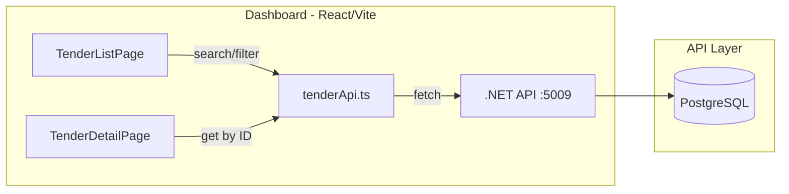

# ProcurePortal Dashboard

React + TypeScript web dashboard for browsing and filtering Canadian procurement tenders. Consumes the [ProcurePortal API](https://github.com/AGabtni/Procurements_Analyzer_API).

## Architecture



## Features

- **Search** — keyword search across title, organization, and notice ID
- **Filter** — by procurement category, notice type, open/closed status
- **Sort** — clickable column headers (title, organization, published, closing date)
- **Paginate** — server-side pagination with page controls
- **Detail view** — full tender info, UNSPSC/GSIN badges, document download links
- **CSV export** — download filtered results as a spreadsheet

## Tech Stack

- **React 19** + **TypeScript 5.8**
- **Vite 6** (dev server + build)
- **Bootstrap 5.3** (styling)
- **React Router 7** (client-side routing)

## Project Structure

```
src/
├── main.tsx                  # App entry point
├── App.tsx                   # Router setup
├── api/
│   └── tenderApi.ts          # API client (fetch wrapper)
├── types/
│   └── tender.ts             # TypeScript interfaces (matches API DTOs)
├── pages/
│   ├── TenderListPage.tsx    # Search + table + pagination + CSV export
│   └── TenderDetailPage.tsx  # Full tender detail + documents
├── components/
│   ├── Layout.tsx            # Navbar + container shell
│   ├── SearchBar.tsx         # Keyword, category, type filters
│   ├── TenderTable.tsx       # Sortable results table
│   └── Pagination.tsx        # Page controls
```

## Setup

### Prerequisites

- [Node.js 18+](https://nodejs.org/)
- ProcurePortal API running at `http://localhost:5009`

### Installation

```bash
git clone <repo-url>
cd Procurements_Dashboard
npm install
```

### Configuration

The API URL defaults to `http://localhost:5009`. To override, create a `.env` file:

```env
VITE_API_URL=http://localhost:5009
```

### Development

```bash
npm run dev
```

Opens at `http://localhost:5173`.

### Build

```bash
npm run build
npm run preview
```

## Pages

### Tender List (`/`)

| Feature | Description |
|---------|-------------|
| Keyword search | Searches title, organization, notice ID |
| Category dropdown | Populated from API (`/api/tenders/categories`) |
| Notice type dropdown | Populated from API (`/api/tenders/notice-types`) |
| Open only toggle | Filter to future closing dates only |
| Sortable columns | Title, Organization, Published, Closing |
| CSV export | Downloads current filtered results |
| Pagination | Server-side, 20 per page |

### Tender Detail (`/tenders/:id`)

Displays full tender information including:
- Organization, category, procurement method, selection criteria
- Region of delivery and region of opportunity
- Publication and closing dates
- UNSPSC and GSIN commodity code badges
- Links to original notice and external portal
- Contact information (name, email, phone)
- Document list with download buttons

## Roadmap

- [x] Tender list with search, filter, sort, pagination
- [x] Tender detail with documents
- [x] CSV export
- [x] Company profile + preferences management
- [x] Lead matching dashboard with scores and status
- [x] Region of delivery/opportunity in tender detail
- [ ] Alert configuration UI
- [ ] Dark mode
